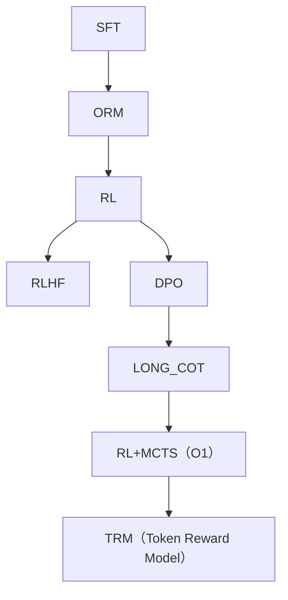
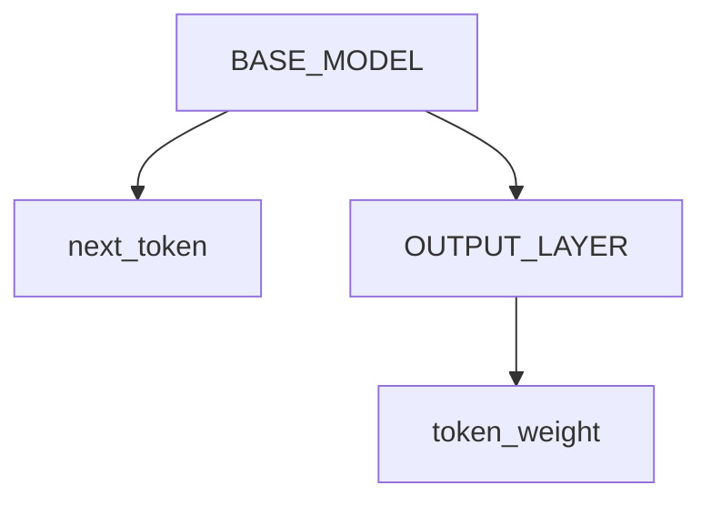

# TRM（Token Reward Model）

## 主体思想
我们发现近期奖励模型从ORM变为PRM，其演进有逐步变小的趋势；同时，受到最近关键token相关研究的启发，我们大胆预测，RM的最终形态应该是TRM（Token Reward Model）。

## 优点
1. 可以完成在线式的关键token训练。
2. 在推理时可以只需几个token就触发回溯，推理速度更快。

## RM演进路线

## TRM
### 实现方案
#### 1. 增加输出头方案

loss = cross_entropy(predict,label) * weight
 可以用softmax/关键token算法，加强对weight的约束。
 但增加输出头的方法由于参数量太少，以及没有额外信息输入的缘故，哪怕用各种方法放大其影响，还是可能会在训练中振荡或退化。
 不过，好处是大道至简，可以完成自我迭代，无需人工介入。

#### 2. RLHF+TRM
使用人工标注的方式，单独训练TRM模型。
 由于有attention可视化和关键token等技术可以辅助标注，TRM的标注难度甚至可能比PRM还要小。

-----------------------------------------------------------------------------

# 下一步计划
自从deepseek和kimi的新模型发布后，人们发现rm不一定是必须的。

但需要指出的是，关键token的思路很对。而deepseek为了避免过长的上下文暴搜，额外加了一个long2short训练环节，我们认为是不优雅的。

所以，我们是不是可以在orm的基础上，融合关键token呢？
